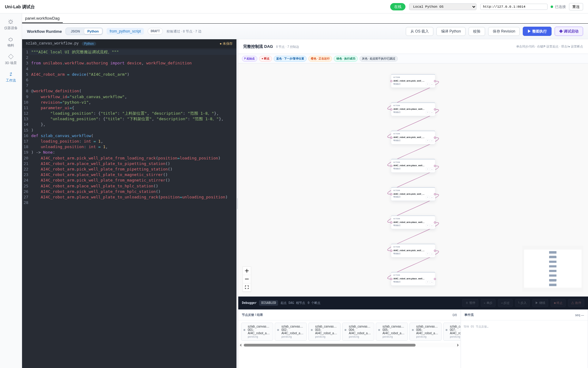

# AI4C 生产工作流 E2E

AI4C 当前包含一个生产 Python 工作流：`szlab_canvas_workflow`，共 8 个节点、7 条控制边。
该 ID 沿用原 local UI/legacy 工作流命名。



机器可读结果见
[`screenshots/all-workflows-e2e-result.json`](screenshots/all-workflows-e2e-result.json)。

启动 AI4C 本地 bridge 与前端后运行：

```bash
./scripts/capture-workflows-e2e.sh
```
