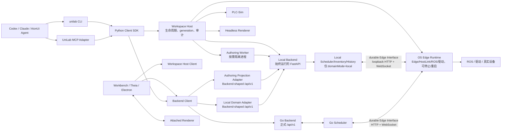

# UniLab AI 原生工作区控制架构研究

> 初稿：2026-08-12
> 本版：2026-08-13
> 设计基线：Uni-Lab OS `product/durable-scheduler-kernel-new@870cf0a5`、Go Backend `main@8c2ad1ce`

## 一、结论

目标不是给 Agent 增加一组绕过 Workbench 的脚本，而是把当前由 Workbench Node 临时拥有的本地环境收敛为一套可编程、可恢复、跨 UI 生命周期的工作区系统。

最终采用以下设计：

1. **Local Backend 在打开工作区后始终运行。** 它提供稳定 FastAPI、工作区监视、Authoring 投影、诊断和本地模式的领域数据；不随设备进程重启。
2. **“重启 OS”只重启 OS Edge Runtime。** Edge Runtime 负责 Edge 协议、ROS、驱动、设备动作和物理完成判据；不拥有工作区源码、Authoring revision 或完整 Workflow/Material HTTP 数据面。
3. **没有 `authoring-only` 模式。** Authoring 是 Workbench 的查看与编辑上下文，不是第三个 Domain Control Plane。设备停止时仍能 Authoring，只是设备执行 capability 不可用。
4. **Domain Control Plane 只有 `local | backend` 两种互斥模式。** 该定义直接采用新 OS 分支：`local` 的 Workflow/Material/Scheduler Authority 位于 Local Backend；`backend` 的 Authority 位于 Go Backend + Go Scheduler。
5. **前端工作流、设备和物料视图始终使用 Backend-shaped `/api/v1` Interface。** 本地代码 Authoring 使用 Local Backend 的 Authoring Projection Adapter；画布编辑与运行事实则根据 `domainMode` 原子选择 Local Domain Adapter 或 Go Backend Adapter。`backend` 模式下画布直接编辑 Backend 工作流定义，本地代码保存不会隐式改写 Backend。
6. **本地设备执行尽量复用生产 Edge 协议。** Local Scheduler 与 Edge Runtime 分进程后，不新增脆弱的临时 RPC；优先让 Local Backend 实现与 Go Backend/Scheduler 同形的 durable HTTP + WebSocket Edge Interface，使 `EdgeControlClient` 可同时连接 local 和 backend Adapter。
7. **Workspace Host 是唯一生命周期权威。** CLI、MCP、Theia、Electron 都是 Client Adapter；它们不直接 spawn/kill Python，不保存唯一 PID、端口或 generation。
8. **Authoring 编译与 Local Backend 分进程。** Local Backend 不直接 import Agent 刚写的驱动和模板；动态加载、编译与预览在可丢弃 Authoring Worker 中完成，成功后才原子发布新 revision。
9. **CLI 是基础能力面，MCP 是 Agent Adapter，Skill 是使用说明。** 三者不重复实现进程控制或领域逻辑。
10. **物料画布采用 attached/headless 双 Adapter。** Agent 同时获得结构、约束和截图，布局修改以 revision CAS 写回工作区。

## 二、统一术语

### 2.1 Managed Local Environment

一个工作区对应的一整套本地环境，不是单个进程：

```text
Managed Local Environment
├── Workspace Host
├── Local Backend                 # 始终运行
├── Authoring Worker              # 按需、可丢弃
├── OS Edge Runtime               # 可停止/重启
├── PLC-Sim / 其他仿真器          # 可选
└── Attached / Headless Renderer  # 可选
```

产品和代码中不应再用“Local Runtime”指代上述所有内容，因为它会混淆生命周期、数据 Authority 和设备执行状态。

### 2.2 Workspace Host

Managed Local Environment 的进程生命周期权威。它持有：

- 工作区锁；
- session manifest 和本地 token；
- 子进程启动、停止、重启、readiness 与日志；
- `device_generation` 和操作审计；
- 稳定文件 generation monitor；
- Local Backend、Authoring Worker、Edge Runtime、PLC-Sim 和 renderer 的发现信息。

Workspace Host 不承载 Workflow、Material、Inventory 或设备动作的第二套领域实现。

### 2.3 Local Backend

跟随工作区生命周期、始终运行的本地 FastAPI 数据平面。它有两个逻辑 Adapter：

1. **Authoring Projection Adapter**：把 last-valid 工作区源码投影成 Backend-shaped 工作流、设备、模板和物料读取 Interface；
2. **Local Domain Adapter**：仅在 `domainMode=local` 时成为 Workflow/Material/Scheduler Authority，持有本地 Inventory、Task/Job、锁、历史与 SSE。

两个 Adapter 可以由同一进程实现，但必须有不同 `baseUrl/sourceId/cache namespace`，避免 Authoring 候选与运行事实混入同一缓存。实现可以在同一 FastAPI 进程监听两个 loopback 端口，也可以挂载两个逻辑根；对前端 Backend Client 而言，两者的相对路由仍是 `/api/v1/workflows`、`/api/v1/materials` 等标准 Interface。

这里的产品边界是 **Authoring 与常驻 Local Backend 合并**：前端和 CLI 只连接一个稳定 Backend 地址，Authoring API、投影库、诊断、SSE 和发布状态都属于该 Backend，不存在另一个 `authoring backend`。`Authoring Worker` 仅是 Backend/Workspace Host 按文件代调用的内部编译沙箱：它不监听业务端口、不保存业务状态，返回结构化候选或诊断后即退出。这是故障域隔离，不是服务拆分。

### 2.4 OS Edge Runtime

“启动 OS”“停止 OS”“重启 OS”操作的唯一对象。它内聚：

- `EdgeControlClient`；
- `edge_control.db`；
- HostLink、Host/Slave 心跳与 ROS 网络参数下发；
- HTTP Job fact fetch、feedback 和 outcome；
- WebSocket command、ACK、outbox 和重放；
- ROS Host/Slave、驱动实例、设备连接与动作回调；
- 物理完成判据和 `UNKNOWN` 设备命令对账；
- 只与当前设备进程有关的诊断 FastAPI。

它不拥有 Authoring 投影、工作流定义、正式库存或调度 DAG。

HostLink 的 Slave 物料请求由 Edge Runtime 通过 DomainBackend port 转交当前 Authority；Edge Runtime 不因此复制 Inventory store。这样 HostLink/ROS 保持设备 Locality，Material Authority 仍保持单一。

### 2.5 Domain Control Plane

沿用新 OS 分支定义：它是 Workflow、Material 和调度事实的单一 Authority，而不是 Workspace 进程管理器。

```text
domainMode=local
    Authority = Local Backend + Local Scheduler

domainMode=backend
    Authority = Go Backend + Go Scheduler
```

两种 Authority 互斥，不能同时写同一 aggregate，不能静默 fallback，不能在前端合并列表后假装成一套事实。

### 2.6 Workspace Authoring、Canvas Definition 与 Runtime Context

这是每个 Workbench/CLI 客户端自己的数据查看上下文，不是进程模式，也不写入工作区全局 session 状态：

| Workbench 上下文 | Backend Client 数据源 |
|---|---|
| Workspace 代码 Authoring | Local Backend 的 Authoring Projection Adapter |
| Canvas Definition + `domainMode=local` | Local Backend 的 Authoring/Local Domain Adapter |
| Canvas Definition + `domainMode=backend` | Go Backend 的工作流图读写 Interface |
| Runtime + `domainMode=local` | Local Backend 的 Local Domain Adapter |
| Runtime + `domainMode=backend` | Go Backend |

因此两个窗口可以同时分别查看 Workspace Authoring 候选和 Runtime 事实；设备停止、启动或重启都不会退出 Workspace Authoring，也不会停止 Local Backend。切到 `backend` 后，画布的编辑、保存、工作流列表和运行属于同一个 Go Backend source；Monaco/Agent 修改的本地 Python 仍由 Local Backend 编译和保存，但不会自动投影到 Backend 画布，也不会形成隐式发布或双写。回到 `local` 后恢复代码与画布双向联动。

### 2.7 Process Role 与 Domain Mode 必须正交

新 OS 分支目前在同一 `unilab` 启动根中同时选择进程内容和 `control_plane`。拆分后应显式形成两个维度：

```text
processRole = local-backend | edge-runtime
domainMode = local | backend
```

- `local-backend` 始终启动；`domainMode=local` 时启用 Local Scheduler/Inventory Authority，`backend` 时只保留 Authoring Projection；
- `edge-runtime` 可停止/重启；它通过配置的 Edge endpoint 连接 Local Scheduler 或 Go Scheduler；
- 不增加 `authoring` Domain Mode，也不让 `edge-runtime` 自己创建第二个 Scheduler Authority。

这一拆分应落在新分支已经存在的 `ControlPlaneRuntimeHandle` Seam 上：保留 local/backend Adapter 的行为和测试，逐步把 local 组合根迁到 Local Backend 进程，并把生产 `EdgeControlClient` 深化为 local/backend 共用的 EdgeExecution Adapter。

## 三、已验证的代码事实

### 3.1 当前 Workbench Node 是 Managed Local 的实际权威

`uni-lab-fe/packages/workbench-session/src/index.ts` 的 `ManagedLocalWorkbenchSession` 当前同时持有：

- OS/PLC/Agent 子进程；
- 动态端口和 run-id 目录；
- `session.json` 与日志；
- graph 副本和 restart 流程。

Theia Node 进程退出会触发 `stopAll()`。这导致 Agent 只能经过 Node RPC 或绕过 Authority 杀进程，UI reload 与设备生命周期耦合，CLI/Electron/Theia 也可能争抢同一工作区。

### 3.2 OS 已有两套可收敛的监督能力

- `unilabos/app/process_supervisor.py`：父进程保持纯监督，产品子进程用专用退出码请求重启；
- `unilabos/managed_runtime/supervisor.py`：loopback HTTP + token，管理 OS Worker 和 PLC-Sim。

它们应收敛进 Workspace Host，不再新增第三套 Node 或 Python supervisor。

### 3.3 工作区完整候选代已经存在

`unilabos/package_manager/workspace_runtime/*` 已支持：

- 稳定文件代；
- 完整候选编译；
- last-known-good；
- `noop/hot_published/pending_restart/failed` 分类；
- 物理图、依赖、驱动/动作合同、资源树和 Site 变化检测；
- 执行中和状态不明时的重启门禁。

需要改变的是所有权：Monitor 移到 Workspace Host，编译移到 Authoring Worker，结果发布到 Local Backend；不需要重写候选代算法。

### 3.4 新 OS 分支已经建立 Domain Control Plane Seam

本次基线为 [`product/durable-scheduler-kernel-new`](https://github.com/Uni-Lab-OS/Uni-Lab-OS/tree/product/durable-scheduler-kernel-new) `870cf0a5d97f9e07cb67e1a3efe4d47fa155934c`：

- `unilabos/app/control_plane.py` 定义互斥的 `ControlPlaneMode.LOCAL | BACKEND`；
- `start_embedded_scheduler_runtime()` 组合本地 Inventory、Scheduler、History 和 HostLink；
- `start_backend_control_runtime()` 不导入本地 Scheduler，只启动生产 `EdgeControlClient`；
- backend 模式不创建 `inventory.db/device_state.db/workflow_history.db`；
- backend 模式 FastAPI 不挂载本地 Workflow/Scheduler/Inventory 路由；
- `CONTEXT.md` 明确 Backend 是 Shared Interface 权威，Edge-only Inventory Interface 不能成为前端 fallback；
- 测试覆盖控制面互斥、backend 模式不导入 Scheduler、不创建本地数据库和不挂载本地领域路由。

该分支已经完成 **Module/Authority 拆分**，但 local Adapter 仍把 Local Backend、Scheduler、HostLink 和设备 Runtime 组合在同一 Python 进程。正式 Workbench 需要在不改变领域语义的前提下继续拆分进程故障域。

### 3.5 新 OS 分支已经实现 durable EdgeExecution

`unilabos/app/edge_control/*` 已提供可直接复用的深 Module：

- command 收到后先写 `edge_control.db`，再 ACK；
- Event 在 `event.ack` 前保留在 outbox；
- `job.start` 使用 `command_uuid/job_uuid/task_uuid/node_uuid` 校验身份；
- Job payload 通过 HTTP 获取，WebSocket 只发送短命令；
- feedback/outcome 先 HTTP 持久化，再用 WebSocket 通知；
- outcome 使用 Idempotency-Key；
- 断线后恢复已接收 Job 和 pending outcome；
- Backend 已终结 Job Token 时安全退役本地 pending outcome；
- `UNKNOWN` 命令必须显式 resolve，不能把不确定物理动作当作普通失败释放锁。

本地进程拆分应复用这些语义，而不是在 Local Scheduler 与 Edge Runtime 之间建立新的非持久 RPC。

### 3.6 当前 runtime storage 生命周期与目标不一致

`unilabos/app/runtime_storage.py` 当前默认给一次 OS 启动创建临时目录，并把本地 `inventory.db/device_state.db/workflow_history.db` 与同一 OS 进程锁绑定。设备进程退出会销毁临时存储。

拆分后必须改变：

- Local Domain 数据跟随 Local Backend 生命周期，不跟随 `device_generation`；
- `edge_control.db` 跟随稳定 Edge identity，不放进会随 generation 删除的目录；
- “重启 OS”不能隐式清空 Task/Inventory/History 或 Edge outbox；
- 清理实验数据成为单独、显式、受审计的 `reset local state` 操作。

### 3.7 Go Backend 是 Shared Interface 权威

本次对账使用私有仓库 [`Uni-Lab-OS/uni-lab-backend`](https://github.com/Uni-Lab-OS/uni-lab-backend) `main@8c2ad1ce6efa0992347655c00f3e91c005256628`。仓库没有单独 OpenAPI，合同事实来自：

- `internal/web/router.go`；
- `internal/web/handler/*.go`；
- `internal/domain/model/*.go`；
- Web/Service 测试；
- `{code, data?, error?{msg, info?}}` 响应信封；
- Scheduler/Edge ADR。

凡 Go Backend 已定义的工作流、设备、模板、物料、Task/Job 和事件能力，Local Backend 必须对齐路径、HTTP 方法、DTO、分页、响应信封、错误、状态和幂等语义。

## 四、目标拓扑



关键不变量：

1. Local Backend 地址不因启动、停止或重启 OS 改变；
2. Authoring SSE 不经过 Edge Runtime；
3. 一个 Canvas Definition/Runtime Context 只选择一个 Domain Authority；
4. Edge Runtime 使用同一个 EdgeExecution Interface 连接 Local Scheduler 或 Go Scheduler；
5. 前端不逐接口 fallback，只原子切换整个 Backend Client Adapter；
6. UI reload 不停止 Local Backend、Edge Runtime、PLC 或活动 Task；
7. Workspace Host crash 恢复后通过 manifest、锁和持久 store 重建快照，不猜测设备动作结果。

## 五、四个核心深 Module

### 5.1 ManagedWorkspace

Interface：

```text
snapshot() -> WorkspaceSnapshot
submit(command, command_id, expected_revision/generation) -> Operation
events(after_cursor) -> ordered stream
```

它隐藏进程树、动态端口、readiness、token、工作区锁、generation、日志、重试和审计。CLI、MCP、Theia 和 Electron 是四个真实 Adapter，因此这个 Seam 已经成立。

### 5.2 LocalBackend

Interface 包含：

- Authoring Projection Adapter 的 Backend-shaped read Interface；
- local Domain Adapter 的完整 Backend Shared Interface；
- `/api/v1/authoring/*` 的源码候选、诊断、预览和激活命令；
- Authoring/Domain SSE 与 snapshot cursor；
- 当前 capabilities、revision 和数据来源身份。

它隐藏工作区投影、last-known-good、SQLite、Local Scheduler、事务、SSE 和 Authoring Worker 结果发布。Local Backend 本身不 import 未验证工作区代码。

### 5.3 DomainBackend Client

前端与 Agent 只学习一次 Go Backend Shared Interface，使用三个 Adapter：

1. Authoring Projection Adapter；
2. Local Domain Adapter；
3. Go Backend Adapter。

选择由 Workbench Context 与 `domainMode` 决定：

```text
context=workspace-authoring           -> authoringBackendBaseUrl
context=canvas, mode=local            -> localDomainBaseUrl
context=canvas, mode=backend          -> goBackendBaseUrl
context=runtime, mode=local           -> localDomainBaseUrl
context=runtime, mode=backend         -> goBackendBaseUrl
```

切换时必须同时更换 Canvas/Runtime 的 `backendSourceId`、认证、SSE cursor 和 query cache namespace。Workspace Authoring Client 独立常驻；切换到 Backend 时必须断开它与当前画布的代码双向同步，但不能停止文件监控或丢失本地候选。

### 5.4 EdgeExecution

Interface 的语义是：接收带稳定 identity 的设备 Job，并持久收敛 feedback、outcome 和不确定物理状态。它不是 WorkflowTask CRUD。

生产 Adapter 已由新 OS 分支实现。Local Adapter 应尽量实现同样的：

- session register/hello；
- durable command + ACK；
- HTTP Job fetch；
- feedback/outcome 幂等提交；
- reconnect replay；
- cancel 与 UNKNOWN reconcile。

这样 Edge Runtime 不需要知道上游是 Local Scheduler 还是 Go Scheduler，获得最大的 Leverage 和 Locality。

## 六、数据与版本模型

必须显式区分以下版本：

```text
source_revision
    当前工作区文件内容

candidate_revision
    正在编译、可能无效的完整候选

authoring_revision
    最近一次验证成功，可供画布查看的投影

active_revision
    已激活给 local Domain 或准备发布到 backend 的版本

task_revision
    WorkflowTask 创建时冻结的 Workflow/Material 执行快照

device_generation
    当前 OS Edge Runtime 启动代
```

不变量：

- 编译失败只推进 `source_revision/candidate_revision`，不覆盖 `authoring_revision`；
- Authoring 保存不自动改变正在执行的 `task_revision`；
- 布局和非激活模板修改不重启 Edge Runtime；
- 驱动、设备图、动作合同、资源树或 Site 结构变化产生 `pending_activation`；
- “重启 OS”用明确的 `active_revision` 创建新 `device_generation`；
- 所有设备状态投影携带 `observed_device_generation`，旧 generation 的迟到事件不能覆盖新代；
- `edge_control.db` 跨 generation 保留，直到 command/outcome 已被权威确认或显式人工处置。

## 七、HTTP 与路由规则

### 7.1 Shared Interface

以下能力相对于各自 `baseUrl` 始终保持 Go Backend 形状：

- `/api/v1/workflows`；
- `/api/v1/resource-templates`；
- `/api/v1/materials`；
- `/api/v1/workflow-tasks`；
- `/api/v1/workflow-node-jobs`；
- `/api/v1/device-action-runs`；
- `/api/v1/events`；
- 其他 Go Backend 已定义路由。

Authoring Projection Adapter 至少对工作流、模板、设备和物料读取保持同路径、DTO、分页、信封和错误语义。它不能伪造运行事实：WorkflowTask run/command、DeviceActionRun 和实时状态通过 capabilities 禁用；直接调用返回信封兼容的 capability-unavailable 错误。

### 7.2 Authoring 扩展

只有 Go Backend 不具备的工作区能力进入：

```text
/api/v1/authoring/snapshot
/api/v1/authoring/diagnostics
/api/v1/authoring/validate
/api/v1/authoring/preview
/api/v1/authoring/activate
/api/v1/authoring/events
```

标准 CRUD 是否可以直接改写源码，必须逐资源证明语义等价。在合同测试完成前，标准 GET Interface 与带 revision CAS 的 Authoring 写命令分开，禁止把“修改真实库存”静默解释成“编辑 Python 源码”。

### 7.3 不能继续存在的路由行为

- 禁止 `/runtime/workflows`、`/local/materials` 等同义 Shared Interface；
- backend 模式下 OS Edge FastAPI 不代理 Go Backend、不挂载本地 Workflow/Inventory；
- Edge-only Inventory Interface 不能成为前端 fallback；
- `/workspace/package-mounts`、`/material-shapes`、`/material-models/*` 必须进入 Go Backend Shared Interface，或归入 Authoring 扩展；
- PID、端口、generation、start/stop/restart 不进入 `/api/v1`，它们属于 Workspace Host Control Interface。

## 八、核心操作流程

### 8.1 保存代码并实时更新 Authoring

1. Agent/Monaco 保存文件；
2. Workspace Host monitor 形成稳定 `source_revision`；
3. Authoring Worker 编译完整候选；
4. 失败：Local Backend 保存结构化诊断，继续提供 last-valid `authoring_revision`；
5. 成功：Local Backend 事务性发布投影和新 `authoring_revision`；
6. Authoring SSE 发送带 cursor 的 revision 事件；
7. 前端保持同一 Authoring Backend Client，刷新工作流、设备、物料和画布；
8. 若变化需要设备激活，产生 `pending_activation`，但不自动重启 OS。

这条链路与 Edge Runtime 是否在线完全独立。

### 8.2 启动或重启 OS

1. CLI/UI 调用 Workspace Host `os.restart`；
2. Host 校验 command id、目标 workspace、`active_revision` 和当前 Task/UNKNOWN 状态；
3. 旧 Edge Runtime 停止接收新 Job，并完成可完成的 outcome/outbox flush；
4. 进程树安全停止；Local Backend、Authoring SSE、Local Scheduler 和 PLC-Sim 不停止；
5. Host 启动新 Edge Runtime，使用稳定 Edge identity 与新的 `device_generation`；
6. EdgeControlStore 从稳定路径恢复 command、Job 和 pending outcome；
7. Edge 向当前 local/backend Authority register + hello；
8. 未确认 command 重放，UNKNOWN 保持锁并显式对账；
9. readiness 成功后 Host 发布 `os.ready`；前端只刷新设备运行态，不 reload 页面和领域数据。

“重启 OS”不再清空历史数据。需要清空时使用独立 `local.reset-state`，要求没有活动 Task/UNKNOWN，记录审计后事务性重建 Local Domain store。

### 8.3 运行工作流

建议 CLI：

```bash
unilab workflow run --workflow <uuid-or-symbol> --inputs @inputs.json --follow --jsonl
unilab workflow watch <task-uuid> --after <cursor> --jsonl
unilab workflow inspect <task-uuid> --include-jobs --include-feedback --json
unilab workflow command <task-uuid> pause|resume|step|cancel --json
```

行为：

- `domainMode=local`：Backend Client 调 Local Domain Adapter，Local Scheduler 经 durable Edge Interface 派发；
- `domainMode=backend`：Backend Client 调 Go Backend，Go Scheduler 经同一 Edge Interface 派发；
- Edge Runtime 未 ready 时，Authority 可按合同创建 `pending` Task/Jobs；
- CLI `--require-os-ready` 只是一项显式客户端门禁，不改变 HTTP 合同；
- Agent 不直接调用 Scheduler、Edge WebSocket、ROS 或驱动。

### 8.4 布局和模板反馈

Agent 需要结构、约束和图像三类信息：

1. `canvas.inspect`：节点、bounds、Material/Site identity、相机和遮挡诊断；
2. `layout.preview`：基于 `base_revision` 生成不落盘 overlay；
3. `canvas.capture`：attached 截取用户当前画面，headless 用于无 UI/CI；
4. `layout.apply`：CAS 写回工作区规范来源；
5. `template.validate/preview`：隔离编译并返回源码诊断、scene 和截图；
6. `template.activate`：验证成功后才推进 active revision。

Pencil 值得复用的是同一编辑/渲染引擎的 attached/headless Adapter，而不是只给 Agent 一张无结构截图。[Pencil CLI](https://docs.pencil.dev/for-developers/pen-cli)

## 九、CLI、MCP 与 Skill

```text
ManagedWorkspace + DomainBackend + CanvasAutomation Modules
                         ↑
                    Python Client SDK
              ↑            ↑             ↑
             CLI          MCP      Workbench Adapter

Skill = 调用策略、业务工作流和安全说明，不拥有状态
```

- CLI：脚本、CI、任何 Agent 和人工排障的基础面；
- MCP：类型化参数、capability discovery、长任务、进度通知和图片返回；
- Skill：告诉 Agent 何时调用、怎样解释和如何迭代；
- MCP 不通过 shell 拼 CLI，CLI 不经过 Node RPC；二者直接使用同一 SDK；
- Theia Node RPC 只作为浏览器 Client Adapter，不再是进程 Authority。

## 十、存储与发现

建议目录：

```text
.unilabos/
├── environment.local.json
├── runtime/workbench/
│   ├── session.json
│   ├── host.lock
│   ├── host.token
│   ├── backend/
│   │   ├── authoring.db
│   │   ├── local-domain/          # local mode Authority
│   │   │   ├── inventory.db
│   │   │   ├── device_state.db
│   │   │   └── workflow_history.db
│   │   └── revisions/
│   ├── edge/
│   │   ├── identity.json
│   │   ├── edge_control.db        # 跨 device generation
│   │   └── generations/<id>/      # 日志、临时文件、诊断
│   ├── authoring/workers/<id>/
│   └── operations/<operation-id>.json
├── logs/workbench/
└── agent/
```

`session.json` 至少发布：

```json
{
  "workspaceId": "stable-id",
  "domainMode": "local|backend",
  "sources": {
    "authoring": {
      "baseUrl": "http://127.0.0.1:AUTHORING_PORT/api/v1",
      "sourceId": "authoring:<revision>",
      "availability": "ready",
      "capabilities": {"workflowRun": false, "deviceActions": false}
    },
    "local": {
      "baseUrl": "http://127.0.0.1:DOMAIN_PORT/api/v1",
      "sourceId": "local:<instance>",
      "availability": "active|inactive",
      "capabilities": {"workflowRun": true, "deviceActions": true}
    },
    "backend": {
      "baseUrl": "https://.../api/v1",
      "sourceId": "backend:<deployment>",
      "availability": "active|inactive|unreachable",
      "capabilities": {"workflowRun": true, "deviceActions": true}
    }
  },
  "device": {
    "generation": "uuid",
    "state": "stopped|starting|ready|restarting|failed"
  }
}
```

Workspace Authoring/Canvas Definition/Runtime Context 是每个 Client Adapter 的本地选择，不写入该全局 manifest。Client 根据 Context 与 `domainMode` 从 `sources` 选择一组 `baseUrl/sourceId/capabilities`。Frontend query key 必须包含选中的 `sourceId`；切换 Context 或 Authority 时取消旧请求、断开旧 SSE、切换认证与 cache namespace，再获取新 snapshot。禁止把不同来源的对象保留在同一 cache。`backend` 模式的画布写操作只调用 Go Backend 工作流图 CAS 接口；本地源码变更继续进入 Workspace Authoring cache，但不刷新当前 Backend 画布。

`capabilities` 表示该 Adapter 是否实现某种行为，`availability` 表示它是否是当前可选择的数据源，`device.state` 表示设备是否可立即执行，三者不能混用。例如 local/backend Adapter 支持 DeviceActionRun，但非当前 Authority 时不可选择，Edge Runtime 停止时也不可立即执行；Authoring Adapter 则从 Interface 层就不支持执行。

安全与恢复规则：

- Workspace Host、Authoring Adapter、Local Domain Adapter 和本地 Edge Interface 默认只监听 loopback；
- token 文件使用 `0600` 或 Windows 等价 ACL，浏览器通过 Theia/Electron Adapter 获取短期凭证，不把长期 token 写进 URL；
- 一工作区只有一个 Host lock；Local Backend 和 Edge store 各自有明确的单写者；
- Workspace Host 监督 Local Backend，异常退出后从持久 authoring/domain store 恢复，并发布新的 backend process generation，但不改变数据 source identity；
- Local Backend 恢复不能自动重启或重复执行设备动作；EdgeExecution 仍以 durable command/outcome 和 UNKNOWN 对账为准；
- 远程暴露 Workbench 时，loopback Interface 只能经认证的 Workbench gateway 转发，不能直接把本地控制端口暴露到互联网。

## 十一、代码调整

### 11.1 Uni-Lab OS

新增/收敛 Workspace Host：

```text
unilabos/workspace_host/
├── model.py
├── host.py
├── discovery.py
├── local_backend.py
├── edge_runtime.py
├── authoring_worker.py
├── monitor.py
├── control.py
├── audit.py
└── client.py
```

直接复用新分支：

- 保留 `ControlPlaneMode.LOCAL | BACKEND` 的 Authority 互斥规则；
- 保留 Backend 模式不导入本地 Scheduler、不创建三类 local DB 的关闭式测试；
- 保留 `EdgeControlClient`、`EdgeDataPlane`、`EdgeControlStore`、身份和 UNKNOWN 对账；
- 保留 HTTP 持久事实 + WebSocket 短通知的协议分工；
- 保留 HostLink/ROS 网络策略和设备 action Adapter；
- 拆开 `start_embedded_scheduler_runtime()` 当前组合根：Local Scheduler/Inventory/History 迁到 Local Backend，HostLink/ROS 网络接线迁到 Edge Runtime；
- 为 Local Scheduler 实现生产 Edge Interface 的 loopback Adapter；
- 将 `workspace_authoring_api` 从 `should_mount_embedded_scheduler_routes()` 条件解除；
- 把当前 `runtime_storage.py` 拆成 Local Domain store 生命周期与 Edge store 生命周期；
- `edge_control.db` 使用稳定 Edge 目录，不能随 generation 删除。

过渡期可保留新分支现有 in-process local Adapter，但正式 Workbench 默认走分进程拓扑；兼容 Adapter 最终只用于测试或 legacy CLI。

### 11.2 前端

- `packages/workbench-session` 从子进程所有者变成 Workspace Host Client Adapter/DTO；
- Theia Node 模块只转发浏览器 RPC，不 spawn/kill OS；
- 旧 Electron `LocalRuntimeManager` 改为同一 Client Adapter，然后删除重复生命周期实现；
- 统一 Backend Client，按 Context/Authority 原子选择 base URL；
- 将 `backendSourceId` 纳入 query cache、SSE cursor 和实体缓存键；
- Authoring 与 Runtime 使用相同画布组件，但明确显示 revision、来源和 capability；
- 公共 material scene/layout/render engine 同时供 kernel-web、Workbench、attached renderer 和 headless renderer 使用；
- AionUi 只持有 Agent 会话和 workspace cwd，不拥有 OS PID。

## 十二、正式交付路线

> 权威技术 Spec 为 [AIW Spec](https://github.com/Uni-Lab-OS/Uni-Lab-Core/issues/215)；实施、提交、截图和验收统一使用 `AIW-x`
> 编号。本文旧版的 `M1–M6` 只是研究阶段的水平迁移提纲，不是已发布 ticket，不再用于汇报实施进度。

### Spec 已固定：合同与术语

- 固定 Go Backend 版本，建立路由/DTO/信封/分页/错误/状态/幂等合同矩阵；
- 固定 OS 新分支 Edge 协议为设备执行基线；
- 明确 Managed Local、Workspace Host、Local Backend、OS Edge Runtime、Domain Control Plane；
- 删除 `authoring-only` 模式和“Runtime=一个 Python 进程”的表述；
- session manifest v2 与一工作区一 Host lock。

### [AIW-01](https://github.com/Uni-Lab-OS/Uni-Lab-Core/issues/216)：Edge 未启动时提供可恢复的工作区 Authoring

- 从设备 bootstrap 拆出 FastAPI、Authoring Projection、Monitor result publisher；
- Local Backend 在选择工作区后启动，保持稳定地址；
- Authoring Worker 独立；
- Authoring 保存、诊断、画布刷新不依赖 Edge Runtime。

### [AIW-02](https://github.com/Uni-Lab-OS/Uni-Lab-Core/issues/217)：Workspace Host 与 `unilab` CLI 共享 Managed Local 生命周期

- 合并两套 Python supervisor 能力；
- Node/Electron 不再拥有子进程；
- CLI 实现 `status/start/stop/restart/logs`；
- 明确 `os.restart` 与 `local.reset-state` 是两个操作。

### [AIW-03](https://github.com/Uni-Lab-OS/Uni-Lab-Core/issues/218)：重启 OS Edge Runtime 时保持 Backend 与任务事实连续

- OS Edge Runtime 只保留 EdgeExecution、ROS、驱动和设备诊断；
- `edge_control.db` 跨 generation；
- Local Backend 实现 durable loopback Edge Adapter；
- local/backend 两种 Scheduler 都能驱动同一 Edge Runtime；
- 重启设备时 Local Backend、Authoring SSE 和 Task History 不断。

### [AIW-04](https://github.com/Uni-Lab-OS/Uni-Lab-Core/issues/219)：原子切换 Local 与 Backend Domain Authority

- 前端 Context/Authority base URL 原子切换；
- `sourceId` / 认证 / SSE cursor / cache namespace 一起切换；
- `local` 模式代码与画布双向同步；`backend` 模式画布直接保存 Backend 工作流图，本地代码修改不生效；
- Local Backend 与 Go Backend 通过合同矩阵。

### [AIW-05](https://github.com/Uni-Lab-OS/Uni-Lab-Core/issues/220)：通过 `unilab` CLI 与 MCP 运行和观察工作流

- run/watch/inspect/command/debug；
- JSON/JSONL、cursor、operation id 与 generation；
- CLI/MCP/Workbench 对同一 Task 和节点状态一致。

### [AIW-06](https://github.com/Uni-Lab-OS/Uni-Lab-Core/issues/221)：让 Agent 检查并截图已打开的物料画布

- `unilab material scene inspect` 返回物料/Site 身份、世界变换、包围盒、
  可见与选择状态、布局 revision 及 source identity；
- `unilab material scene capture --attached` 只通过 Workspace Host 发现当前
  唯一 renderer，不硬编码 Workbench 端口，也不由 CLI 抓取浏览器 DOM；
- Workbench 在真实公共 Material 视口内临时应用 2D/2.5D/3D、Site/转运层、
  选择/隐藏、viewport 与 camera preset；截图完成后恢复用户视图；
- 2D/2.5D 使用同一前端 DOM/SVG renderer 栅格化，3D 复用 Pascal 离屏 GPU
  RenderTarget；两条路径都等待字体、图片、模型与几何稳定帧；
- CLI 与 MCP 共用 `MaterialRendererClient`，输出 PNG 原子写入、SHA-256、尺寸、
  renderer generation、workspace/source/revision 元数据；
- 2026-08-13 在 SZLab 0810 工作区 E2E 验证：132 个物料、422 个 Site，
  1440×960 的 2.5D/3D 与 1024×768 的 2D 截图成功；整页 reload 后 attached
  renderer 自动恢复且 source identity 保持为 `local` / Workspace Backend 49832。

### [AIW-07](https://github.com/Uni-Lab-OS/Uni-Lab-Core/issues/222)：通过布局 CAS 与 Headless Renderer 闭环模板优化

- `unilab material layout inspect|preview|apply` 与同合同 MCP tools 已实现；
  preview 以稳定 `sourceNodeId` + expected revision 产生规范候选、约束诊断、结构
  diff 和不可变 preview artifact，不修改设备图；apply 只接受该 preview identity，
  并以源文件 SHA-256 revision 执行 CAS 与原子替换。
- 布局变更支持设备平移、旋转、视图/相机/viewport preset，以及只通过
  `/api/v1/material-models/` 发布且可选绑定工作区 `sourcePath` 的模板资产；local
  apply 通过 Backend-shaped API 更新运行中的 Local Backend，再请求同一 Material
  viewport reload，使源码、Backend projection 与已打开画布同步；`backend`
  Authority 下关闭式拒绝工作区布局隐式写入，避免双写。
- `unilab material template validate` 在一次性 Python 子进程中静态编译完整
  PackageCatalog，不导入作者驱动；坏模板只返回结构化诊断，不停止 Workspace
  Host、Local Backend 或污染 last-valid scene。
- Workbench 关闭时，Workspace Host 可按需启动普通 Workbench Theia bundle 与
  Chromium adapter；它和 attached 模式共享 React/Pascal scene、布局与截图实现，
  不维护第二套 renderer，且可由 Host 单独停止。
- 每张截图同时原子保存 PNG 与结构元数据：workspace、source identity、layout /
  template revision、viewport、renderer version、renderer generation 和 SHA-256；
  `material scene compare` 同时比较像素与节点 placement/bounds/Sites 等结构事实，
  阈值、批准和基线替换均为显式操作。
- 2026-08-14 在 SZLab 0810 工作区完成真实闭环：inspect → attached capture →
  preview（源文件摘要不变）→ apply（Local Backend 更新 1 个节点，已打开 viewport
  reload）→ recapture；旧 revision 重放稳定返回 `layout_revision_conflict`。验证中将
  `s2_tip_warehouse` x=3065 临时改为 2945 后恢复；像素变化 0.4248%，结构比较命中
  `scene.nodes`。关闭 Workbench 后又由 Host 自动启动 headless renderer，成功输出
  1200×800 的 3D top-view PNG，随后通过同一控制面停止。

### [AIW-08](https://github.com/Uni-Lab-OS/Uni-Lab-Core/issues/223)：跨平台与故障恢复总验收

- 汇总 AIW-01–AIW-07 的公开合同验收；
- 验证 Host / Backend / Edge / Renderer 独立故障恢复；
- 固定 macOS、Windows、Linux 验证状态和可回滚 SHA 组合。

## 十三、必须通过的 E2E

1. 只启动 Workspace Host + Local Backend，不启动 Edge Runtime，也能浏览和实时编辑工作流、设备、物料及模板；
2. 保存无效 Python 时返回结构化诊断，last-valid Authoring 画布不消失；
3. 启动/停止/重启 OS 时 Local Backend 地址、Authoring SSE cursor 和前端页面均不改变；
4. “重启 OS”不清空 Workflow、Material、Task/Job、History 或 Edge outbox；
5. `local.reset-state` 在有活动 Task/UNKNOWN 时拒绝，在安全状态下完整审计并原子重建；
6. local 模式由 Local Scheduler 经 durable Edge Interface 完成 PLC-Sim 最长工作流；
7. backend 模式由 Go Backend 创建 Task，Go Scheduler 向同一 Edge Runtime 派发；OS 不创建 local Domain DB；
8. 重复 `job.start`、网络断开、Edge Runtime crash/restart 不重复执行设备动作；
9. feedback/outcome 已 HTTP 持久但 WebSocket 通知丢失时，Authority 能扫描并最终收敛；
10. `UNKNOWN` 保持设备锁，只有显式 resolve 后才能继续；
11. 工作区编辑只推进 Authoring revision；活动 Task 固定 task revision；
12. 驱动/物理图变化产生 `pending_activation`，执行中不自动重启；
13. 一个窗口查看 Authoring 候选、另一个窗口查看 Runtime 事实，两者独立更新且不发生跨 source cache 污染；
14. 前端切换 Authoring/Runtime Context 时原子更换 base URL、sourceId、认证、SSE cursor 和 cache namespace；
15. UI reload/crash 不停止 Local Backend、Edge Runtime、PLC 或活动工作流；
16. Local Backend crash 后由 Workspace Host 恢复，last-valid Authoring、Local Domain 数据和 source identity 不丢失，也不重复设备动作；
17. 两个 UI/Agent 同时观察同一 source 时，snapshot、cursor 和 generation 一致；
18. Agent 能通过 CLI 完成 OS restart、workflow run/watch/command 和日志回读；
19. Agent 获取 material scene 结构与 attached 截图，CAS 修改布局；并发人工修改时拒绝覆盖；
20. Workbench 未打开时 headless renderer 仍能验证模板并截图；
21. macOS、Windows、Linux 均通过动态端口、进程树停止、文件锁和 token/ACL 测试；
22. Local Backend 与 Go Backend 的重叠路由通过完整合同矩阵，OS 扩展全部在审核 allowlist。

## 十四、外部架构参照

- VS Code Agent Host：长生命周期 Agent 与 UI/Extension Host 分开，客户端可断开重连。[VS Code Agent Host](https://code.visualstudio.com/docs/agents/concepts/agent-host)
- VS Code Extension Host：按 UI/workspace locality 隔离扩展故障域。[VS Code Extension Host](https://code.visualstudio.com/api/advanced-topics/extension-host)
- MCP：适合作为类型化 Agent Adapter，不定义应用内部运行时 Authority。[MCP Architecture](https://modelcontextprotocol.io/docs/2026-07-28/learn/architecture)
- Jupyter：动态端口、用户私有 connection manifest 和可重启执行内核。[Jupyter Kernels](https://jupyter-client.readthedocs.io/en/stable/kernels.html)
- Pencil：同一编辑引擎提供 attached 与 headless 模式，并向 CLI/MCP 暴露截图和编辑能力。[Pencil CLI](https://docs.pencil.dev/for-developers/pen-cli)

## 十五、最终判断

采用新 OS 分支后，不应推倒重写调度、库存或设备协议。正确的深化路径是：

- 保留 `local/backend` 单 Authority；
- 保留 Backend Shared Interface；
- 保留 durable Edge HTTP/WebSocket 协议；
- 把 Local Backend/Scheduler 从设备进程迁出并常驻；
- 让同一个 EdgeExecution Module 连接 local 或 backend Scheduler；
- 把 Workspace Host、Authoring Worker 和 renderer automation 补到现有 Seam 上。

最终产品语义非常简单：

> 打开工作区就有 Local Backend 和实时 Authoring；启动 OS 才连接设备；重启 OS 只重启设备进程；运行工作流时由唯一的 local 或 backend Authority 调度。

这使 `LocalBackend`、`ManagedWorkspace`、`DomainBackend Client` 和 `EdgeExecution` 都成为有足够 Depth 的 Module：前端与 Agent 学习更少的 Interface，复杂性集中在正确的实现位置，获得跨 CLI、MCP、Theia、Electron 和 CI 的 Leverage 与 Locality。
