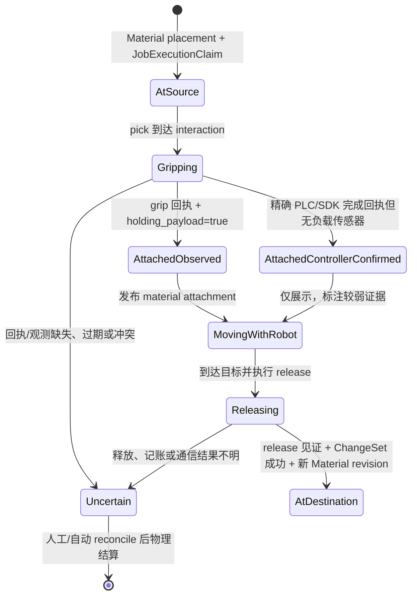

# Introduction

本计划补齐两项动态 3D 能力：快换机构完成工具更换后，前端显示当前夹爪并把它挂到机械臂法兰；夹爪确认抓住物料后，前端把唯一的物料 3D 节点挂到夹爪抓取 frame，使它随机械臂关节状态自然运动。

现有代码已经提供大部分深模块：Robotics 有 `ToolDefinition`、`ToolChangerPort`、`EndEffectorPort`、`ToolContext`、工具锁紧/附着代次和夹爪负载观测；MoveIt 有 ToolContext 激活；FE Pascal 已按显式 `model.format` 加载 URDF/Xacro/STL/GLTF/FBX/OBJ，并能把任意已加载场景节点挂到精确设备 link。因此本计划不新增第二套夹爪控制协议或第二套模型加载器，也不在 FE 每帧复制机械臂位姿。新增边界仅是一个不携带模型格式、只描述父子关系的运动学附着投影（KinematicAttachmentProjection，候选名）。

> **2026-08-25 实施状态**：合同、OS latest/SSE、FE 单节点 overlay、MoveIt
> payload collision 接缝和 SZLab 符号身份薄绑定已经落地并通过各自定向测试；生产
> 执行结果自动生成投影、现场 Adapter 能力证据、ChangeSet/Claim/Fence 结算仍是
> 待接通边界。未接通前不得把当前代码宣称为生产端到端完成。

## Wayfinder Grill 冻结基线

| Grill | 冻结选择 | 实施约束 |
|---|---|---|
| G1 | G1-1 双投影动态附着 | MoveIt attach collision profile；FE attach 独立 URDF/Mesh；基础机械臂 URDF 不包含快换夹爪 |
| G2 | G2-1 统一 ToolDefinition 资产包 | 工具 distribution 统一拥有 visual、collision、frame、质量、重心与 digest |
| G3 | G3-1 四项严格确认 | `tool_ref + locked + attachment_generation + PlanningScene 回读` 全部一致才 attached |
| G4 | G4-3 完全静态夹爪模型 | 首期不发布/渲染指爪 joint；MoveIt 使用单一保守固定碰撞包络；不影响整个工具和物料随动 |
| G5 | G5-2 分级负载证据 | `observed` 可参与强结算；`controller_confirmed` 仅供 3D 展示 |
| G6 | G6-1 PayloadCollisionProfile | 物料碰撞资产显式版本化，不直接信任任意视觉 URDF/Mesh |
| G7 | G7-1 显式 grasp_frame | ToolDefinition 声明抓取 frame，recipe/点位声明物料根相对位姿 |
| G8 | G8-1 包内符号、启动解析 | 设备包禁止运行时 UUID；OS exact 解析当前 identity |
| G9 | G9-1 OS latest + TTL + reconcile | 首期不改 Backend 持久化；重启后 stale/unknown 并从设备恢复 |
| G10 | G10-1 MaterialPlacement runtime overlay | FE 复用单节点、loader 与 link reparent，不写业务 Material store |
| G11 | G11-1 分阶段放料结算 | release 见证、MoveIt detach、ChangeSet、新 revision、清 overlay 有序收敛 |
| G12 | G12-1 冻结最后可信姿态 | stale/uncertain 保持 Claim/Fence，不跳回源库位、不隐藏潜在实体 |
| G13 | G13-1 通用高层动作 | Workflow 只见 `change_tool/pick/place`，不得拼装底层安全步骤 |
| G14 | G14-1 Capability negotiation | 缺能力时诚实隐藏/降级/拒绝，禁止 noop success 与生产 `skip_*` |

## 模型表示与跟随关系正交

| 对象 | 业务身份 | 推荐视觉表示 | 父锚点 | 跟随方式 |
|---|---|---|---|---|
| 机械臂 | Device | URDF（包含可动 joint/link） | world 或导轨 mount link | JointState 更新 URDF 关节 |
| 快换夹爪 | Device | 单体 STL/GLB；若自身有可动指爪才使用 URDF | 机械臂 `flange_link` | 现有 Three.js reparent；mesh/URDF 都相同 |
| 被夹物料 | Material | 保留现有 URDF、STL 或 GLB | 夹爪根节点，或 URDF 夹爪的 `grasp_link` | 同一 reparent；格式不参与附着判定 |
| 载架 | Material/Device（按现有领域定义） | 保留现有 URDF | world、Site 或被夹持时的夹爪锚点 | 静态 placement 或运行时 overlay |

模型格式只由既有 `config.rendering.model.format`/文件路径决定。附着投影只携带 `child_material_id + parent_material_id + anchor(root/link) + local_pose`；OS 不解析 STL/URDF，FE 先用现有 loader 得到统一 `Object3D`，再使用同一父子挂载实现跟随。

夹爪在 MoveIt 中显示为 mesh 并不与“夹爪是 Device”冲突。MoveIt 的 `AttachedCollisionObject` 是执行/碰撞表示，FE 的 `model.format` 是视觉表示；两者用 `tool_ref + model/collision digest + attachment_generation` 关联，但不能互相替代。

## 权威与投影边界

| 事实 | 权威来源 | OS 的职责 | FE 的职责 | 明确禁止 |
|---|---|---|---|---|
| 当前安装的工具 | `ToolChangerPort.observe()` 返回的工具身份、锁紧、附着代次 | 校验后发布工具附着投影；摘要或代次不匹配时发布 `unknown` | 按投影加载工具模型并挂到法兰 link | 根据最后一次按钮点击猜当前夹爪 |
| MoveIt 当前工具几何 | `ToolContextActivator` 对同一 digest/attachment_generation 的确认 | 保留同一工具上下文摘要 | 只展示同一摘要对应的 visual 模型 | 3D 模型替代 MoveIt 碰撞对象 |
| 夹爪是否持有负载 | `EndEffectorPort.observe()`，或明确标注为较弱证据的控制器完成回执 | 在作业执行占用与栅栏范围内发布物料附着投影 | 将现有物料节点挂到工具 `grasp_frame` | FE 从动作进度或时间延迟推断抓取成功 |
| 物料最终位于哪个库位 | Material/Site Authority 的变更集（ChangeSet） | 放料完成后原子提交源/目标库位变化 | 收到新 Material revision 后恢复静态 placement | 运行时 3D 投影直接改库存 |

## 状态流程

## 最小改动方案

| 仓库 | 修改前 | 修改后 | 优点 | 限制/影响 |
|---|---|---|---|---|
| `unilab_robot_template` | 已能换工具、激活 ToolContext、抓取/释放并读取负载；没有供平台消费的统一附着快照 | 增加一个 format-free typed attachment snapshot；工具和负载仅是两个 kind，引用现有端口，不增加执行器 | 厂商 PLC、SDK、MoveIt 仍共用现有 Ports & Adapters | 厂商适配器必须声明证据等级；不能把普通成功字符串当精确回执 |
| `Uni-Lab-SZLab` | 领域动作知道 source/target material 和 Site，部分 PLC 流程允许 `check_gripper_payload=False` | 部署组合根把当前 Material/Job/Claim 上下文注入通用 Robotics 投影器；不复制通用逻辑 | SZLab 只保留领域绑定和现场 policy | 无负载传感器时只能发布 `controller_confirmed`，不能作为库存或安全证据 |
| `Uni-Lab-OS` | `DeviceTelemetryProjection` 只接受 `device_properties` 与 `joint_state` | 加入严格 `kinematic_attachment` latest 类型、HTTP commit、SSE snapshot/change 与 TTL；保留 boot/sequence/accepted_ref | 复用现有遥测传输和背压，不增加新的实时总线 | 本地 latest 非持久；重启后必须 stale/unknown 并等待 reconcile |
| `uni-lab-fe` | Material placement 已支持 root/link anchor，统一模型 loader 已支持六种格式，`LabDeviceRenderer` 已支持实际 Three.js reparent；服务只解析两种 telemetry | 只增加 attachment 解析与 `MaterialPlacement` 运行时 overlay；继续调用现有 loader、projection 和 renderer | 不增加模型分支或跟随渲染器；关节更新自动带动子节点 | Backend Profile 需服务端转发该 telemetry；本轮不改 backend 时仅 Edge/OS Profile 可用 |

## 1. Requirements & Constraints

- **REQ-001**: 工具更换必须由 `tool_ref + locked + attachment_generation + ToolContext.digest` 四项一致后才进入 `attached`；任何缺失、过期或冲突都进入 `unknown`。
- **REQ-002**: 工具 visual 资产必须声明稳定 `flange_frame`、`tcp_frame`、`grasp_frame`、模型摘要与相对位姿；执行碰撞资产继续由 ToolContext/MoveIt PlanningScene 管理。
- **REQ-008**: Device/Material 类型不得决定模型格式；资产 owner 必须显式声明 `model.path + model.format`，attachment wire 不得重复携带 path/format/mesh 内容。
- **REQ-003**: 抓取物料后只创建只读运行时附着投影，不直接把 Material Authority 的持久 placement 改成机械臂 link；最终库位变化仍由 ChangeSet 原子提交。
- **REQ-004**: 物料附着投影必须绑定 Material 身份、当前机械臂设备、父 link、局部抓取位姿、命令/作业引用、观测时间、新鲜度、boot/sequence 和证据等级。
- **REQ-005**: FE 必须复用唯一物料场景节点并执行 reparent，禁止复制第二个“手上物料”；源库位辅助显示不得再渲染一个实体副本。
- **REQ-006**: release 后不得立即把物料跳回源库位；只有目标 placement 的新 revision 到达后才移除 overlay。若 release 或 ChangeSet 不明，保持 `uncertain`、JobExecutionClaim 与 Fence，不自动重放。
- **REQ-007**: 没有负载传感器但 PLC/SDK 有精确命令完成代次时，允许发布 `controller_confirmed` 供 3D 展示；该状态不得用于库存提交、安全互锁或 PhysicalSettlement。没有精确回执则禁止显示为已夹取。
- **REQ-009**: 首期夹爪内部关节采用完全静态模型；不得新增 gripper joint telemetry、FE 指爪开合动画或 MoveIt 状态化夹爪碰撞 Profile。工具 collision 必须使用覆盖允许开合范围的单一保守包络。
- **SEC-001**: FE、卡片和 3D renderer 都不得调用夹爪、快换、Material 写接口或解除 Fence；它们仅消费只读投影。
- **CON-001**: 不修改 `uni-lab-backend` 时，动态附着只保证 Local OS/Edge Profile；远端 Backend Profile 必须等待其转发同一 telemetry contract，不能静默伪装可用。
- **CON-002**: 保持机械臂、导轨、工具和物料为独立资产；快换工具不得烘焙回机械臂基础 URDF，导轨不得进入机械臂 MoveIt planning group。
- **CON-003**: G4-3 只限制夹爪内部指爪关节；工具根节点仍按 G1-1 动态挂到 `tool0`，物料仍按 G7-1 挂到稳定 `grasp_frame`。
- **GUD-001**: 设备包资产使用稳定符号 frame/link 名，不把运行时 UUID 写入设备包；运行时 OS 绑定可以携带 Material/设备 UUID。
- **PAT-001**: 使用“设备观测 → format-free typed attachment → 既有 MaterialPlacement overlay → 既有 model loader/reparent”的深模块；Material Graph 仍是静态业务真相，scene runtime 负责高频/临时状态。

## 2. Implementation Steps

### Implementation Phase 1

- GOAL-001: 冻结工具、夹爪和 FE link-parenting 的既有能力，先定义无歧义附着合同。

| Task | Description | Completed | Date |
|------|-------------|-----------|------|
| TASK-001 | 在 `unilab-robot-contracts` 新增单一 format-free `KinematicAttachmentProjection`；`tool/material_payload` 只是 kind。合同定义 child/parent runtime identity、root/link anchor、局部位姿、`attached/controller_confirmed/detaching/uncertain`、摘要/代次、命令/作业引用和 TTL，明确禁止模型 path/format。 | Yes | 2026-08-25 |
| TASK-002 | 扩展工具资产描述，要求 `flange_frame`、`tcp_frame`、`grasp_frame` 与 visual/collision digest；给 CR5/CR7 夹爪示例补齐快换架和抓取 frame 黄金 fixture。 | Partial：合同已完成，真实夹爪黄金资产未提供 | 2026-08-25 |
| TASK-003 | 修正并扩充现有 ToolContext/ToolAttachment 测试，证明 tool_ref、`context_id`、digest、attachment_generation 和 PlanningScene 激活使用同一规范化身份。 | Yes | 2026-08-25 |

### Implementation Phase 2

- GOAL-002: 在 Robotics 组合根产生可信工具/负载附着快照，不把投影逻辑散到厂商适配器。

| Task | Description | Completed | Date |
|------|-------------|-----------|------|
| TASK-004 | 在 `unilab-robot-runtime` 增加 AttachmentProjector，订阅/读取现有 `ToolChangerPort` 与 `EndEffectorPort`；工具只在 ToolContext 激活成功后 attached，负载只在 AccessMotionBlock 抓取观测后 attached。 | Partial：投影器已完成，尚未自动挂入生产 AccessMotionBlock 结果 | 2026-08-25 |
| TASK-005 | 给 PLC/SDK/MoveIt adapter 增加证据能力声明：`payload_sensor`、`exact_completion_generation`、`tool_id_sensor`；将弱证据显式映射为 `controller_confirmed`，拒绝无身份普通成功返回。 | Partial：共享能力合同与 SZLab 默认关闭配置已完成，厂商 Adapter 未逐个声明 | 2026-08-25 |
| TASK-006 | 在 SZLab 设备组合根注入当前 Material、JobExecutionClaim/Fence 和 source/target Site 上下文；只做运行时身份解析，不在 YAML/点位文件持久化 UUID。 | Partial：符号→当次 UUID 薄绑定已完成，Claim/Fence 与执行结果来源尚未接通 | 2026-08-25 |

### Implementation Phase 3

- GOAL-003: 复用 OS 设备遥测 latest 深模块传输附着投影。

| Task | Description | Completed | Date |
|------|-------------|-----------|------|
| TASK-007 | 在 `device_telemetry.py` 增加严格 `kinematic_attachment` 校验、accepted latest、TTL/stale 和订阅过滤；限制批量大小、frame 名、摘要、位姿数值与状态组合。 | Yes | 2026-08-25 |
| TASK-008 | 在 `device_telemetry_api.py`、`telemetry_publisher.py`、`client.py` 和 HTTP adapter 增加 attachment commit/notify；复用现有 boot_id、sequence、accepted_ref 与 SSE snapshot/change，不新建第二条总线。 | Yes | 2026-08-25 |
| TASK-009 | 将 execution_unknown、重启、过期、Fence 未结算映射为 `uncertain/stale`；禁止删除 latest 后自动把物料放回源 Site。 | Partial：TTL/stale 已完成，UNKNOWN/Fence 自动投影仍待执行链接入 | 2026-08-25 |

### Implementation Phase 4

- GOAL-004: 让 FE 使用现有 Three.js link parenting 显示快换工具与夹持物料随动。

| Task | Description | Completed | Date |
|------|-------------|-----------|------|
| TASK-010 | 扩展 `packages/services/src/realtime.ts` 解析 `kinematic_attachment`，在 `scene-runtime` 保存按 child identity 索引的 attachment latest，并直接规范化为现有 `MaterialPlacement.parent` 形状；不写 Material Zustand store，不触发 React Flow revision。 | Yes | 2026-08-25 |
| TASK-011 | 给 Pascal Material projection options 增加 `runtimePlacementByMaterialId`，在 `materialAggregatesToSceneGraph()` 入口构造有效 aggregate map 后继续调用现有 `projectPlacement()`/`resolveAggregateWorldPose()`；模型 path/format 仍来自原 aggregate，支持 robot→gripper→payload 多级链。 | Yes | 2026-08-25 |
| TASK-012 | `modelRuntime.ts`、`materialPlacementProjection.ts` 和 `LabDeviceRenderer.tsx` 不新增 URDF/mesh 分支或跟随代码；只在现有测试中补 STL 夹爪挂 URDF 机械臂、URDF 物料挂 STL 夹爪、父 link 缺失和 stale/uncertain 用例。 | Partial：复用路径与虚拟 frame 已完成，真实夹爪/物料资产集成夹具仍待补 | 2026-08-25 |
| TASK-013 | release 后等待 Material Graph 新 revision，再清除 overlay 并显示目标 Site placement；为 source Site、手上、target Site 的单实例约束增加集成测试。 | Partial：FE revision gate 已完成，ChangeSet/PhysicalSettlement 生产链仍待接通 | 2026-08-25 |

## 3. Alternatives

- **ALT-001**: FE 收到 `pick` 动作成功就本地启动跟随动画。未采用，因为动作成功、夹爪持有和 Material 身份可能不一致，刷新/重连后无法恢复，也会绕开 Fence。
- **ALT-002**: 抓取期间立即持久化 Material placement 为机械臂 link。未作为短期方案，因为当前 OS/Backend 的 Material 写合同和 FE adapter 尚未完整实现原子 reparent，而且会把短暂运动状态写进业务图。若未来需要跨作业长期持有物料，应另立“物料保管/夹持”领域决策。
- **ALT-003**: 每个 joint frame 后手算工具和物料世界坐标。未采用，因为 FE 已有 link parenting，重复正运动学会产生帧漂移、额外渲染和第二套坐标真相。
- **ALT-004**: 把夹爪 mesh 永久并入机械臂 URDF。未采用，因为会破坏快换、更换型号、工具碰撞上下文和单机械臂包复用。
- **ALT-005**: 按 Device/Material 类型硬编码 URDF 或 mesh renderer。未采用，因为业务身份和资产格式无关，会导致同一夹爪换为可动 URDF 时必须重写 OS/FE 跟随逻辑。

## 4. Dependencies

- **DEP-001**: Robotics 现有 `ToolChangerPort`、`EndEffectorPort`、`ToolContextActivator`、`AccessMotionBackend` 和 Job/Fence 语义保持可用。
- **DEP-002**: OS 现有 `DeviceTelemetryProjection` 的 HTTP→短通知→SSE latest 链路保持稳定。
- **DEP-003**: FE 现有 Pascal `projectPlacement()`、`LabDeviceRenderer` link reparent 和 exact `topologyDigest` JointState 应用保持稳定。
- **DEP-004**: 真实设备若要显示 `observed` 级负载，现场 PLC/SDK 必须提供负载传感器或等价可验证见证；否则只能是 `controller_confirmed` 展示级状态。

## 5. Files

- **FILE-001**: `unilab_robot_template/packages/unilab-robot-contracts/src/unilab_robot_contracts/tools.py`、`observations.py` 与新 `attachments.py`：工具/夹持附着合同和证据等级。
- **FILE-002**: `unilab_robot_template/packages/unilab-robot-runtime/src/unilab_robot_runtime/access_motion_backend.py`、`manipulation.py` 与新 `attachment_projector.py`：从现有执行和观测生成投影。
- **FILE-003**: `unilab_robot_template/packages/unilab-arm-*/src/unilab_arm_*/models/` 和夹爪/快换 distribution：工具 visual/collision、法兰/TCP/grasp frame 资产。
- **FILE-004**: `Uni-Lab-SZLab/szlab_poly_studio/devices/szlab_mixer_robot/` 的部署组合与现场 adapter：只注入 Material/Claim/Site runtime context 和能力声明。
- **FILE-005**: `Uni-Lab-OS/unilabos/app/edge_control/device_telemetry.py`、`device_telemetry_api.py`、`telemetry_publisher.py`、`client.py`、`http.py`：附着 latest 的校验、提交和 SSE。
- **FILE-006**: `uni-lab-fe/packages/services/src/realtime.ts`、`packages/scene-runtime/src/index.ts`、`apps/kernel-web/src/integrations/lab-workbench/SceneWorkbench.tsx` 与 `packages/workbench-theia/src/browser/workbench-material-viewport.tsx`：复用现有 DeviceTelemetry 连接，接收 attachment latest 并规范化为 `MaterialPlacement.parent`。
- **FILE-007**: `uni-lab-fe/packages/pascal-lab-plugin/src/materialAggregateSceneTypes.ts`、`materialAggregateSceneBridge.ts`、`PascalLabWorkbench.tsx`：订阅低频 attachment 变更，用有效 aggregate map 复用现有场景投影。
- **FILE-008**: `uni-lab-fe/packages/pascal-lab-plugin/src/modelRuntime.ts`、`materialPlacementProjection.ts`、`renderers/LabDeviceRenderer.tsx`：实现原则上不改，只在相邻测试增加跨 URDF/STL 和 root/link 附着回归覆盖。

## 6. Testing

- **TEST-001**: Robotics 合同测试覆盖工具身份/锁紧/代次/digest 四项一致、负载观测新鲜度、弱证据分级和 UNKNOWN 传播。
- **TEST-002**: OS telemetry 测试覆盖 strict shape、boot/sequence 单调、幂等 accepted_ref、TTL/stale、非法 frame/pose/digest 拒绝及 SSE 重连快照。
- **TEST-003**: FE 单测证明工具换型后旧节点卸载、新节点挂到 flange；机械臂关节更新时工具与物料无需 Material store 更新即可随动。
- **TEST-004**: FE 集成测试证明同一 Material 同时只渲染一次，抓取时离开 source，放料并收到新 revision 后出现在 target；UNKNOWN 不跳回源点。
- **TEST-005**: 单机械臂、机械臂+导轨、PLC、SDK、MoveIt 四种部署矩阵中，未声明快换或夹爪能力时功能诚实隐藏/降级，不影响原 3D 与动作。
- **TEST-006**: 安全测试证明 attachment projection、卡片和 FE 不能产生 RobotCommand、ChangeSet、JobExecutionClaim、Fence release 或 PhysicalSettlement。

## 7. Risks & Assumptions

- **RISK-001**: 当前 SZLab 多个 PLC Workflow 使用 `check_gripper_payload=False`；若没有精确 PLC 完成代次，只能显示 `uncertain`，不能为了动画效果伪造已夹取。
- **RISK-002**: Material Graph 在搬运完成前仍显示源 Site 为业务 placement；3D overlay 会把实体移到夹爪。必须依赖同一 JobExecutionClaim 阻止其他作业使用该物料/库位，并在 UI 标识“搬运中”。
- **RISK-003**: FE 父 link 名与 URDF/GLB 节点映射漂移会导致工具或物料不显示；用 `topology_digest + exact link name` 失败关闭，不做模糊匹配。
- **RISK-004**: Local OS 重启会丢失内存 latest，但真实夹爪可能仍持料；重启后必须 Fence + reconcile，前端显示 stale/unknown，不能自动恢复库存或重新派发。
- **ASSUMPTION-001**: 当前需求是生产状态的可信 3D 展示，不授权 FE 控制夹爪或用 3D 结果替代物理互锁、库存权威和调度结算。

## 8. Related Specifications / Further Reading

- `/home/zhangshixiang/Uni-Lab-Core/plan/design-minimal-3d-integration-1.md`
- `/home/zhangshixiang/Uni-Lab-Core/uni-lab-fe/docs/architecture/material-scene-runtime.md`
- `/home/zhangshixiang/Uni-Lab-Core/unilab_robot_template/docs/LOCAL_MAINTENANCE_WORKFLOW.md`
- `/home/zhangshixiang/Uni-Lab-Core/CONTEXT.md`
- `/home/zhangshixiang/Uni-Lab-Core/plan/design-robot-tool-material-wayfinder-grill-1.md`
